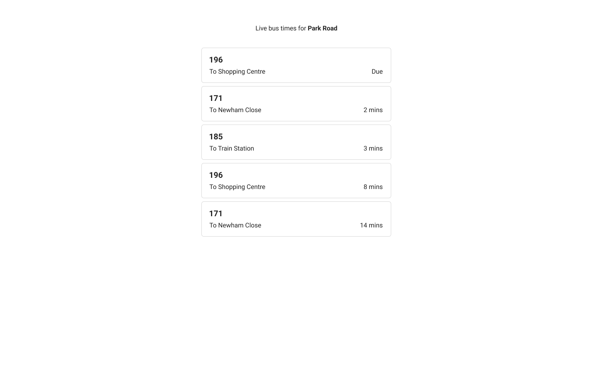

**Project structure**
Web - React TypeScript application accessible at http://localhost:8080. Generated with Vite (similar to Create React App).

API - Node.js TypeScript application accessible at http://localhost:3000. Generated with Nest.JS framework (similar to Express.js).

## Requirements

- The app should fetch and display bus times from the existing `\bus-times` API endpoint on page load
- The app should highlight when buses are due (1 minute or less til arrival)
- The app should automatically refetch the bus times every 10 seconds
- The user should only see routes that run on the current day of the week
- The app should match the design outlined in the mockup below

Additionally, what are some other ways you might want to improve or extend this application? This could include changes to the user experience, front-end and/or back-end. Feel free to leave comments or implement these changes if you have time.

**Mockup**

